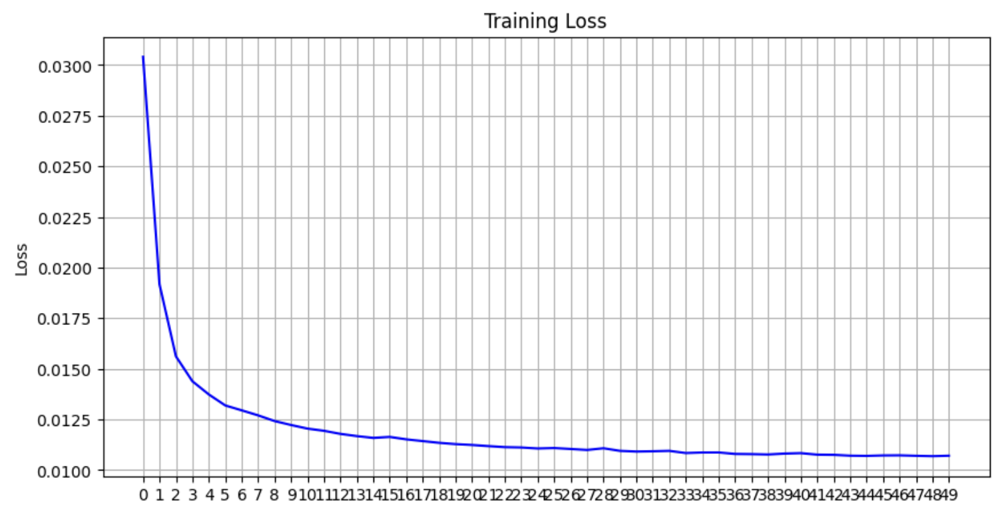

## 2024_processing_and_generating_images_course
## Фейгинова Милена Дмитриевна 

## Homework #2

### Task: 
Anomaly Detection

### Dataset:
The provided dataset for the task is from industrial production ([link to disk](https://drive.google.com/file/d/1DHuQ3DBsgab6NtZIZfAKUHS2rW3-vmtb/view)). It consists of:

- Only normal images in train: 10 001 items
- Only anomaly (leak) images in proliv: 155 items
- both normal and anomaly omages in train: 3794 items

There are images of the technological process of pouring metal cylinders. The dataset consists of industrial images labeled into two categories:

- 0: no leakage (normal state of process)
- 1: leakage

The class imbalance is quite high, however, it is enough to identify threshold for anomaly detection and assess quality of the model. 

### Achieved quality:

- True Positive Rate: **78%**
- True Negative Rate: **86%**

### Architecture:

- *Started with:* self-composed Denoising Autoencoder + MSE Loss + mean threshhold. 
- *Switched to:* Denoising Autoencoder + MSE Loss + argmax(f1) threshhold.
- *Final model:* Denoising Autoencoder + Combined MSE+ Loss + argmax(f1) threshhold:

### Experiments:

- [Link to google collab](https://colab.research.google.com/drive/1DLeb6SQs3Nh9TnZyptU03z6-CVkoksII?usp=sharing)

0. **Baseline**

**Architecture:** 
You can see the Denoising Autoencoder on the scheme above.  

- encoder and decoder both have three linear layers
- decrease in dimention dowm to 128
- ReLU activation function applied for encoder
- Sigmoid applied for decoder output 

MSE is used for loss and threshhold is identified by simply calcilating mean of error on proliv dataset.

**Results:**

We can see that loss is decreasing stedily and has potential to decrease more (50 epochs were used for training). 
Let us take a look at confusion matrix below. Evidntly, the normal class (True negatives), has higher quality as it is better represented.
True negative rate is thus much higher (89%). This means, that threshold is identified not in the most effecient way.

**Conclusion:** Mean error is too simple way to identify threshold that does not fully grasp the data peculiarities.
It is necessary to make logic more complicated.

1. **Advanced threshold logic**

**Goal:** Increase accuracy, apply more complicated and justified logic to the choice of threshold.

**Idea:** Use both normal and anomalous validation data to find the optimal threshold. This approach is more robust because it:
- Uses both normal and anomalous samples
- Finds the threshold that best separates the two classes
- Can optimize for specific metrics (like F1 score)

**Results:** As expected, we see great improvement in True Positive rate, meaning that anomalies are now identified
much better. However, there is a drop in True Negative rate and accuracy, mening that threshold has become less conservative
and now identifies more normal images as anomalies.

**Conclusion:** TPr and TNr have proportional dependency, thus, by merely working with threshold, we can mostly influence their
balance, but not the optimization of both at once.

2. **Combined loss**

**Goal:** increase generalisation capabilities of autoencoder, make it more conservative in decoding normal images.

**Idea:** insted of MSE loss only, use combined loss of MSE and L1 in proporting 0.8 and 0.2 respectively.
The L1 loss (Mean Absolute Error) is less sensitive to outliers compared to MSE. Also, while MSE focuses on minimizing reconstruction error, 
L1 helps maintain detail and preserve important features in the data, leading to higher-quality reconstructions

**Results:** We see that TPr and TNr have become more balanced. Accuracy has improved, however, did not reach the
baseline level. 

As for loss, compared to baseline, it started worse in first epochs, however, by 30th managed to perform better than
baseline. Thus, there is a hypothesis that we will be able to improve quality further by increasing number of epochs.

**Conclusion:** combined loss of MSE and L1 allows to benefit from both their strengths. It also allows better feature learning:
- MSE focuses on minimizing the average squared differences, which can lead to sharper reconstructions. 
However, it may produce blurry outputs when reconstructing images.
- L1  encourages sparsity in the learned representations, which can help the autoencoder capture more meaningful features by
penalizing large errors without being overly influenced by them

3. **Increase number of epochs to 100**

**Goal:** to increase quality and explore the potential of new combine loss that apparently needs more time to find its minimum. 

**Idea:** increase number of epochs to 100

**Results:** Metrics flactuate, there is no significant improvement despite a much larger number of
epochs (x2). Let us have a look at loss.

We can see that reaching the 90th epoch, loss goes back up. The model seems to be overfitting.
The number of 100 epochs was not chosen optimally.

**Conclusion:** More epochs does not necessarily mean better quality. Simpler models tend to overfit.

4. **Number of epochs - 70**

**Goal:** optimize number of epochs not to overfit the model

**Idea:** set epochs to 70 

**Results:** Loss has increased a bit, however, the results are much better for both True Negative
rate and True Positive rate. Accuracy has increased significaintly, F1 score beat the baseline.

**Conclusion:** number of epochs can play a great role in quality of the model. 
Again, more is not always better.

