## 2024_processing_and_generating_images_course
## Фейгинова Милена Дмитриевна 

## Homework #4

### Task: 
Distillation Types

### Dataset:
CIFAR-10 - датасет содержит 60 000 цветных изображений размером 32x32 пикселя, разделенных на 10 классов:
- Самолеты
- Автомобили
- Птицы
- Кошки
- Олени
- Собаки
- Лягушки
- Лошади
- Корабли
- Грузовики

Распределение данных:
- Тренировочный набор: 50000 изображений
- Тестовый набор: 10000 изображений

В каждом классе содержится 6000 изображений, из которых 5000 используются для обучения и 1000 для тестирования

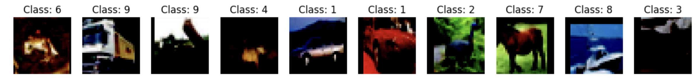
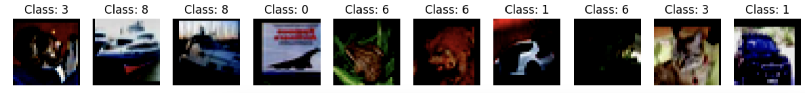

### Achieved quality:

- Student Model Precision: 0.7982
- Student Model Recall: 0.7973
- Student Model F1: 0.7971

### Architecture:

Лучшее качество показала архитектура, в которой учим студента совпадать с учителем по скрытому состоянию 
(используем пулинг)

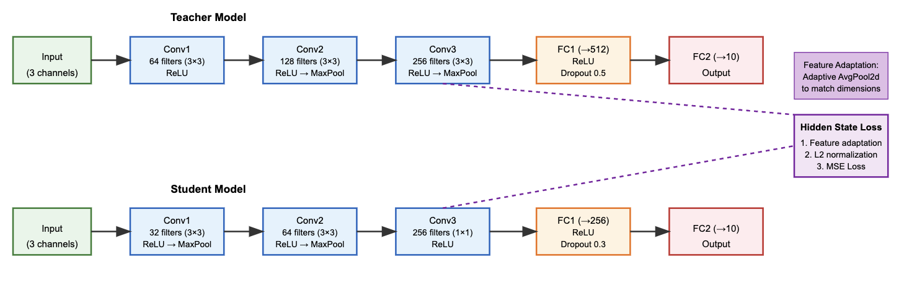

### Experiments: [Link to google collab](https://colab.research.google.com/drive/1ox6_dvg_Z2ew-UQj7oVUFpNIsnSIzFyK?usp=sharing)

0. **Baseline**

**Архитектура Учителя:** 

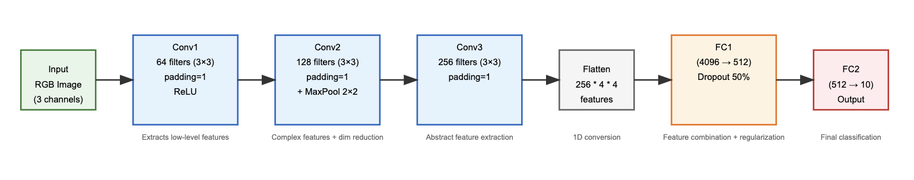
  

**Архитектура Студента:** (модель менее глубокая и сложная)

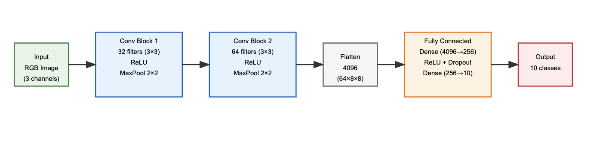

**Results:**

Обучение модели - Учитель
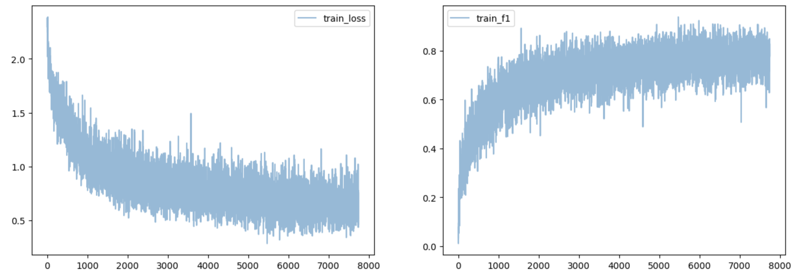

Обучение модели - Студент
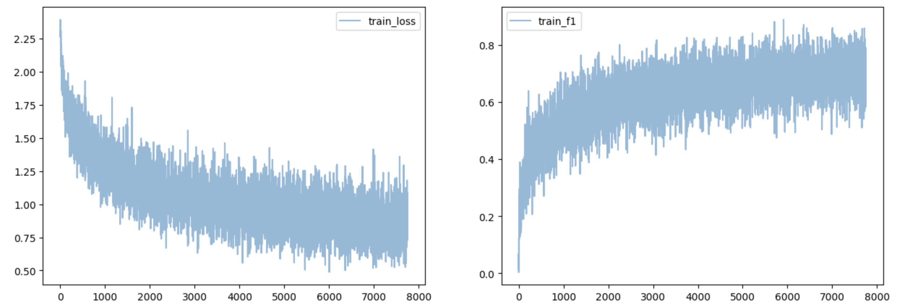

Видим, что лосс студента медленнее движется вниз и больше скачет. F1 учителя на трейне достиг 80, 
в то время как студент добрался только до 75. Сравним метрики качества на тесте:

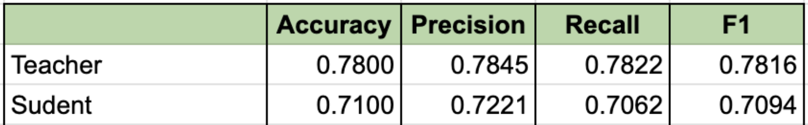

Видим, что качество учителя значительно выше качества студента. Целью дальнейших экспериментов будет повысить качество студента 
за счет "передачи знаний" учителя с помощью разных подходов.

1. **Logit distillation**

**Goal:** улучшить качество модели, сократить инференс 

**Idea:** Дистилляция реализована с использованием:

- Temperature scaling для смягчения логитов
- Комбинированной функции потерь (KL-divergence + CrossEntropy)
- Отключения градиентов для учителя во время дистилляции

**Results:** 

Видим, что лосс намного менее волатилен и имеет тренд к постоянному снижению, а F1 стал чуть выше. 
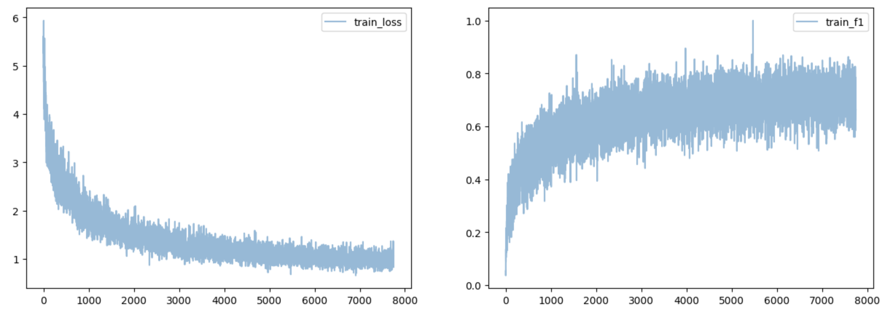

Сравним метрики качества. Видим, что модель студента по прежнему сильно отстает от учителя. Однако, в сравнении с бейзлайном,
получилось поднять recall и F1 почти на один процентный пункт. Precision тоже немного вырос. Среди классов по качеству 
выделяется первый (автомобили) и третий (кошки), но в целом распределение метрик равномерное.

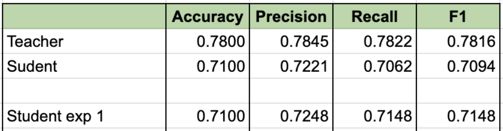 

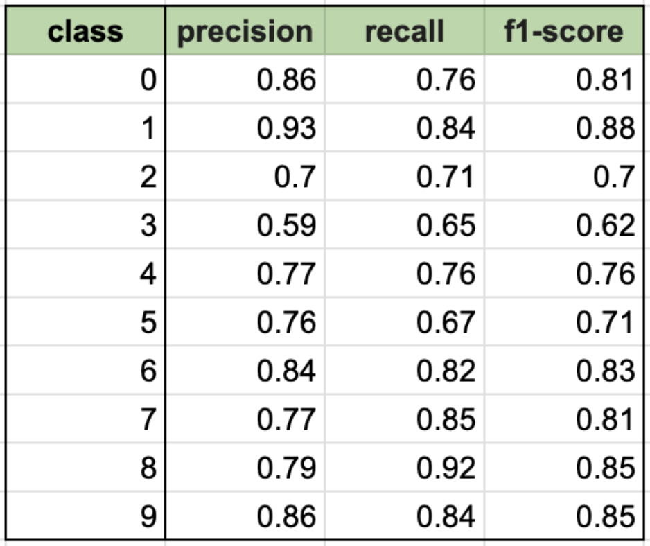

**Conclusion:** без каких-либо серьезных и тяжелых усложнений архитектуры, нам удалось выбить +1пп к качеству модели.
Предположительно, усилив модель учителя, мы можем получить еще лучший прирост к качеству. 

2. **Immitation hidden state**

**Goal:** попробовать еще улучшить качество модели студента

**Idea:** Основные изменения и особенности этой реализации:

- архитектура:
методы get_features() для получения промежуточных активаций;
forward теперь возвращает как выход, так и скрытые состояния
- Сопоставление скрытых состояний:
адаптивный пулинг для согласования размерностей; L2-нормализация признаков; веса для разных уровней скрытых состояний
- Функция потерь:
комбинирует loss классификации и loss скрытых состояний; 
MSE для сравнения нормализованных признаков;
можно настраивать веса для разных уровней

Процесс обучения:
- Учитель заморожен (eval mode)
- Студент обучается соответствовать как выходам, так и скрытым состояниям учителя

**Results:**  
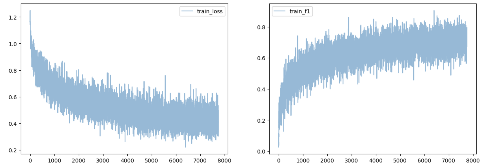

Новая архитектура позволила существенно приблизиться к метрикам качества учителя. В среднем +2 пп относительно бейзлайна, 
при сравнении моделей студента. 

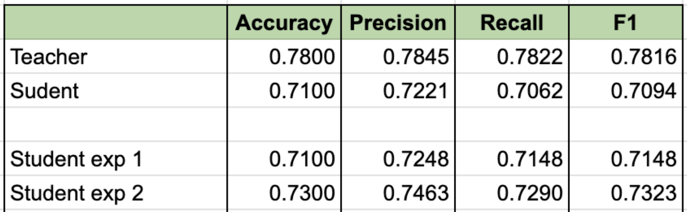

**Conclusion:** в нашей постановке задачи, "обмен знаниями" лучше работает на начальных этапах архитектуры (обмен фичами),
чем в конце (дистилляция логитов).

3. **Add regressor**

**Goal:** попробовать еще улучшить качество модели студента

**Idea:** Основные изменения в этой реализации:

- класс FeatureRegressor: 
использует Conv2d(1x1) для преобразования размерности каналов;
включает BatchNorm для стабилизации обучения
- архитектура студента (StudentNetWithRegressor):
добавлены три регрессора для разных уровней признаков;
отдельные методы для получения оригинальных и преобразованных признаков
- комбинированная функция потерь (CombinedLoss): 
сочетает CrossEntropy для классификации и MSE loss для сравнения преобразованных признаков; поддерживает веса для разных уровней признаков

Процесс обучения: 
- Учитель заморожен
- Оптимизация и регрессоров, и основной сети студента
- Балансировка между классификацией и регрессией признаков

**Results:** 

Лосс менее волатильный, но по графику можно предположить, что он застрял в локальном минимуме.
Также уже на трейне видим, что F1 ниже, чем в предыдущем эксперименте. Посмотреим на тест.
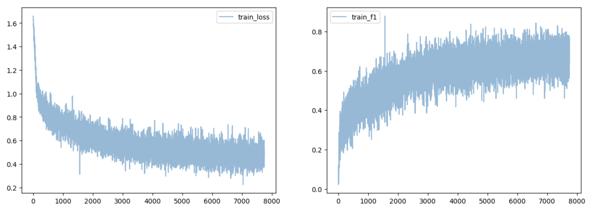

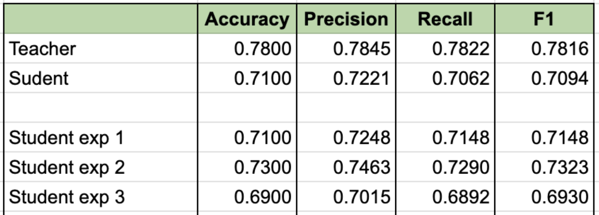

Метрики сильно хуже не только по сравнению в прошлым экспериментом, но даже уступают бейзлайну. 
Какие могут быть возможные причины:

1. Архитектурные проблемы:
   - Регрессоры (Conv2d 1x1) могут быть слишком простыми для эффективного преобразования признаков
   - Добавление BatchNorm после регрессоров может нарушать статистики признаков учителя
   - Регрессия напрямую к размерности учителя может быть слишком "агрессивной" (например, с 32 до 256 каналов)

2. Проблемы оптимизации:
   - Веса различных компонент loss (alpha и feature_weights) могут быть неоптимальными

3. Проблемы с признаками:
   - Принудительное соответствие признакам учителя может мешать студенту найти свои эффективные представления
   - Пространства признаков учителя и студента могут быть слишком разными для прямой регрессии

**Conclusion:** More epochs does not necessarily mean better quality. Simpler models tend to overfit.

4. **Финальный трейн на 70 эпох**

**Goal:** зафиксировать результат на лучшей архитектуре, подобрав оптимальное кол-во эпох 

**Results:** 

Лучшее качество показала архитектура, в которой учим студента совпадать с учителем по скрытому состоянию 
(используем пулинг). Прогоним ее на 70 эпох. Видим, что разброс лоса мешает найти минимум, однако до конца есть динамика на небольшое снижение.
Возможно стоит снизить скорость обучения или поэксперементировать с весами в комбинации лосов.

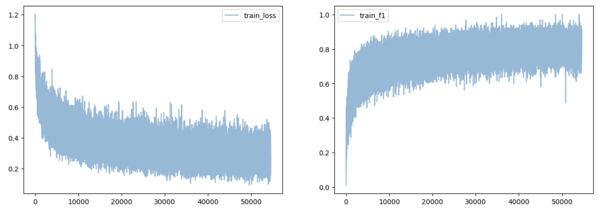

Несмотря на несовершенство модели, получилось обогнать даже модель учителя. Распределение метрик между классами более-менее равномерное,
выделяется класс три (кошки). Подобрав оптимальные гиперпараметры, можно
улучшить качество еще на несколько процентных пунктов. Также стоит подумать над усложенинем модели учителя, так как 
ее оптимизация напрямую влияет на метрики качества студента. 

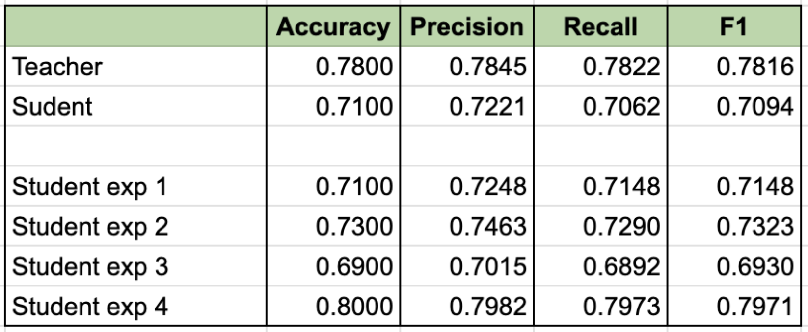
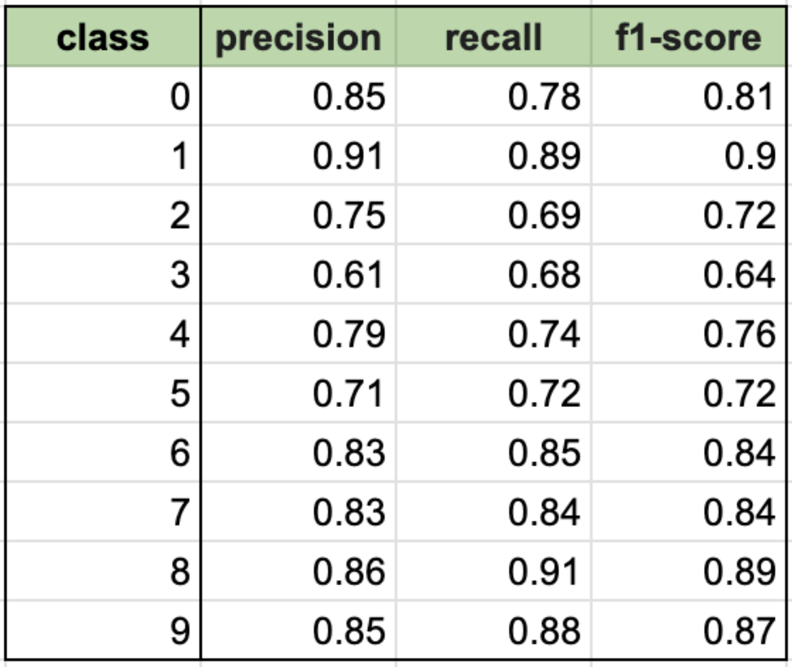

