## 2024_processing_and_generating_images_course
## Фейгинова Милена Дмитриевна 

## Homework #1

### Task: 
Image Classification

### Dataset:
Alzheimer MRI Disease Classification dataset ([Hugging face link](https://huggingface.co/datasets/Falah/Alzheimer_MRI)) that focuses on the classification of early sympthoms of Alzheimer's disease based on MRI scans. 

- Number of examples in train: 5120
- Number of examples in test: 1280

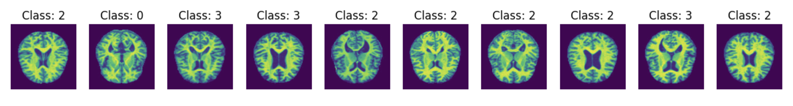

The dataset consists of brain MRI images labeled into four categories:

- 0: Mild_Demented - start of Alzheimer's
- 1: Moderate_Demented - early progression of Alzheimer's
- 2: Non_Demented - healthy brain
- 3: Very_Mild_Demented - prerequisites to Alzheimer's

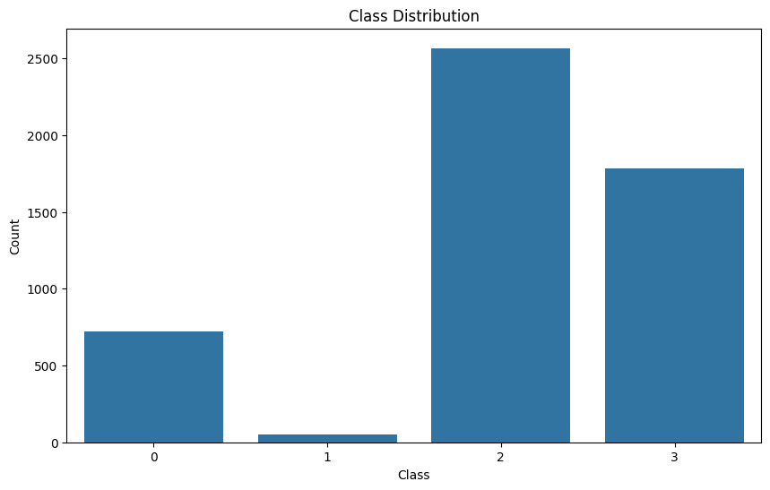

The class imbalance is quite high, however, if we learn to predict second class (healthy brain) with high precision, we can consider model successfull regardless of the lower quality of other classes. In medical area of research precision plays a bigger role if we are talking about positive (health) classes and recall is more important when we talk about negative (disease) classes. The inbetween can be managed by patient's examination, while missing a disease can turn out lethal.

### Architecture:

- *Started with* pre-trained ResNet50 model + modification of last layer. 
- *Switched to* EfficientNet-B2 (better performance on medical images) with selective layer freezing.
- *Final model* is an advanced EfficientNet-B2. Architecture:

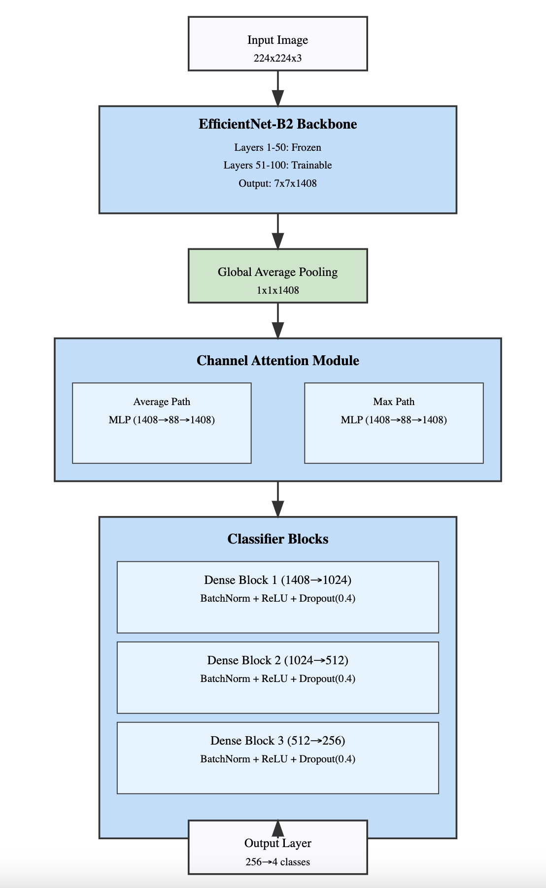

### Experiments:
- [Link to W&B project](https://wandb.ai/milfey21/alzheimer-classification/table)

- [Link to google collab](https://colab.research.google.com/drive/1B_n5-yYOsl3asdWEqz7ZIeHgIXEW6SPS?usp=sharing)

0. **Baseline**

**Architecture:** 
For baseline ResNet50 was used. It is a deep convolutional neural network that is effective for image classification tasks. 

The original final layer of ResNet is replaced with a new sequential container that consists of several layers:

- fully connected layer.
- ReLU activation function applied element-wise.
- dropout layer with a dropout probability of 0.5. This randomly sets half of the input units to zero during training, which helps prevent overfitting.
- another fully connected layer that outputs features. This corresponds to the final classification scores for each class (in this case, different stages or types of Alzheimer's disease).

**Results:**

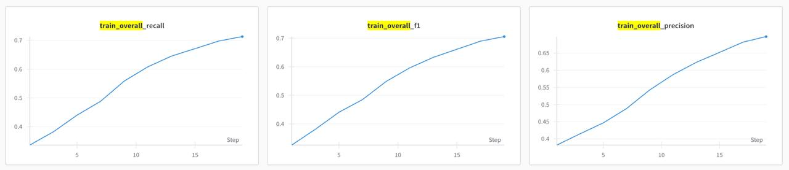

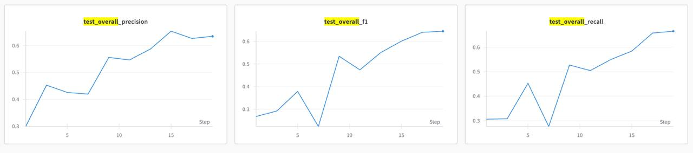

We can see that difference between metrics on train and test is insignificant. This is good and means that models doesn't overfit.
Let us take a look at confusion matrix below. It is clear that Moderate_Demented class (1) is not identified by the model. 
It also has significaintly less samples compared to other classes and is mostly confused with Nondemented class.
This makes sense as these classes look extremely alike at a first glance.

Class 0 -- Class 1 -- Class 2 -- Class 3

We can also see the justification on the graphs. On test classes 0, 2, and 3 show similar dynamic, while for class 1 all metrics are equal to 0.
The negative trend is also noticeable for class 1 on train data.

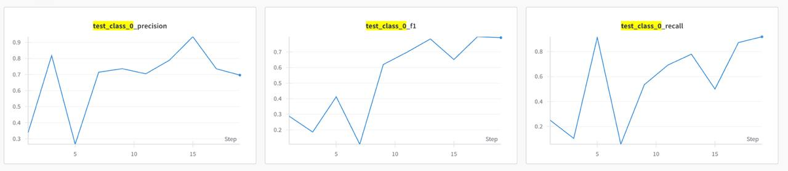

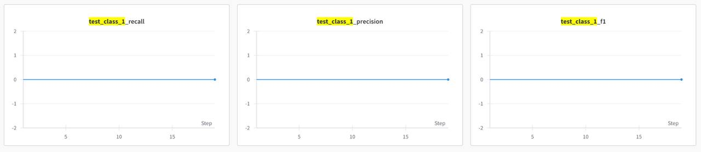

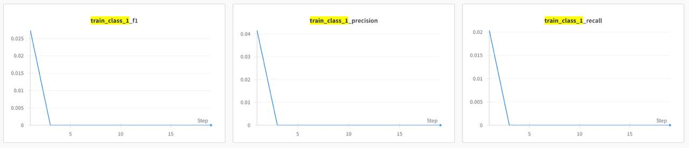

**Conclusion:** Moderate_Demented class does not get identified by the model. The changes might be very suttle and it is hard for the model to grasp them. 
In further experiments, it is necessary to consider working on class imbalance issue and try data augmentation to make Moderate_Demented class more noticeable to the model.

1. **Data Augmentation**

**Goal:** increase accuracy by augmenting data and making it more diverse. The main target here is second class (healthy brain), for which it is necessary to increase precision. 

**Idea:** Implement data augmentation techniques such as random cropping, horizontal flipping, rotation, and color jittering. It helps improve generalization by artificially increasing the size of the training dataset and introducing variability. 

**Results:** I will not get much into per class metrics as all of them have dropped significaintly, while loss grew from 0.36 up to 0.77.

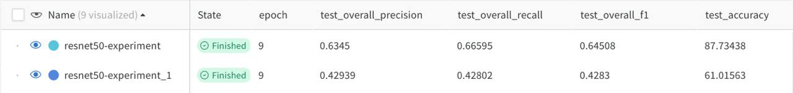

**Conclusion:** While data augmentation showed worse metrics compared to baseline, I still decided to test further with data augmentation as I believed that it could be usefull further, once class imbalance is deatl with.

2. **Balanced Sampling**

**Goal:** to decrease impact of imbalance in classes. To ensure that during each training epoch, the model sees a balanced representation of all classes, which helps improve performance metrics 

**Idea:** to use WeightedRandomSampler. Count the occurrences of each class label in the dataset and assign weights equal to probability of that sample being selected during training

**Results:** Even on 4th epoch model already showed much higher metrics compared to baseline.

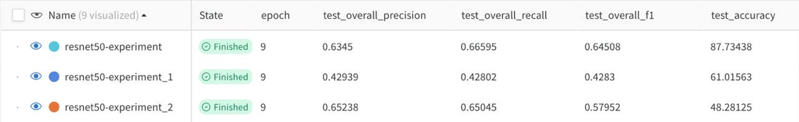

What is also important, class 1 finally showed good validation metrics:
- test_class_1_f1	0.92857
- test_class_1_precision	1
- test_class_1_recall	0.86667

However, loss grew to 1.09.

**Conclusion:** the balanced sampling positively manages class imbalance, thus will be used further in th model while conducting additional experiments.

3. **EfficientNet-B2**

**Goal:** to explore other available pre-trained models and try to acheve better quality. 

**Idea:** EfficientNet-B2 is known to perform better on medical data. For instance, it achieved precision and recall rates above 95% in detecting conditions like COVID-19 and brain tumors, indicating its robustness in identifying subtle patterns in medical images that are critical for accurate diagnosis. I decieded to freeze 30 early layers for transfer-learning.

**Results:** 
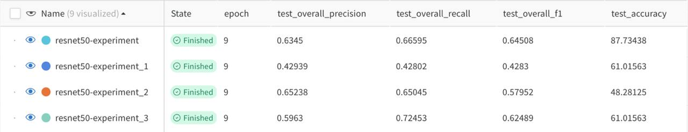

Although precisison has decreased (majorly at the expense of worse precision for imbalanced classes), all other metrics grew significaintly.
Also, loss decreased to 0.87.

It can be due to class imabalnce: a model predicts a majority class correctly but struggles with minority classes, 
it can still achieve high accuracy and recall while having low precision due to many false positives in its predictions.
Also, If the model starts to overfit on the training data, it may learn to predict certain classes well while failing to generalize effectively across all classes. 

**Conclusion:** EfficientNet-B2 indeed showed better results on medical data than ResNet50. Without any additional adjustments, the 21% increase in accuracy was achieved.
However, issues of overfitting of majorly presented classes and class imbalance are still present and have to be addressed.

4. **Advanced Classifier**

**Goal:** further increase precision and recall, thus, generalisation capabilities. Especially it is important for less represented classes by preventing overfitting

**Idea:** to use deep multi-layer classifier with residual connections and add batch normalization after each layer. Apply progressive dropout (higher in early layers) helps prevent overfitting, especially when dealing with smaller datasets. Xavier initialization for better convergence.

**Results:** 

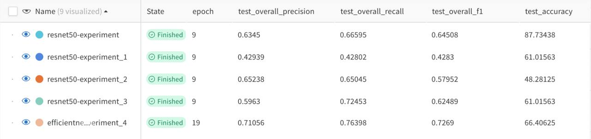

All tracked metrics are growing and loss is decreasing. The same trend can be seen per class.
It is important to note that along with advanced classifier, I increased number of epoques. 
However, we can see on the graph below that even on earlier epochs this model showed higher quality.

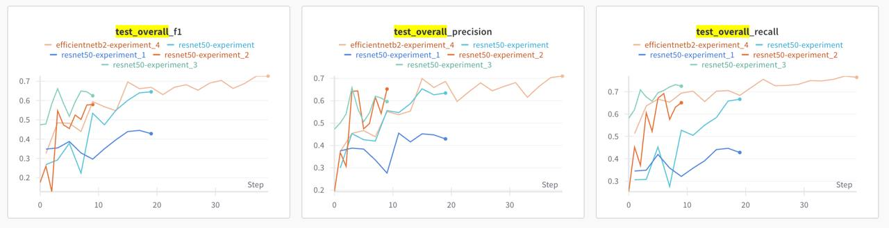

**Conclusion:** Advanced classifier helped improve metrics for small classes and reduce the gap between precision on train and test datasets.

5. **No data augmentation**

**Goal:** increase precision

**Idea:** having conducted many tests, I understand that there is too little data to experiment with its variations.
Especially in small classes where variation is harmful. Coming back to experiment one, we can see that augmentation caused drop in quality of classification.
Thus, the same advanced pipeline will be tested without it.

**Results:** 

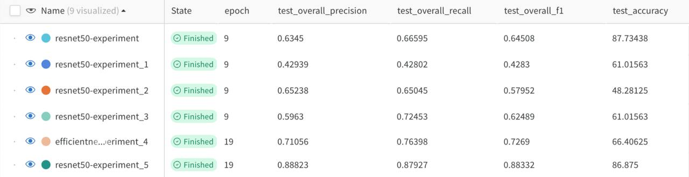

As expected, quality grew significaintly. 

**Conclusion:** Apparently, the dataset is indeed too small for extensive data augmentation. I also believe that it can be a peculairity of medical data. As all images are of brains with the same position, it is not helpful to rotate and change images as real velue is hidden in tiny changes of the brain scans.

6. **Class weights in loss function**

**Goal:** further manage significant class imbalance problem. In standard training without class weights, a CNN may become biased towards majority classes.

**Idea:** to encorporate weights in loss function. Use basic approach and assign each class a weight equal to probability of meeting this class in train dataset.  

**Results:** 

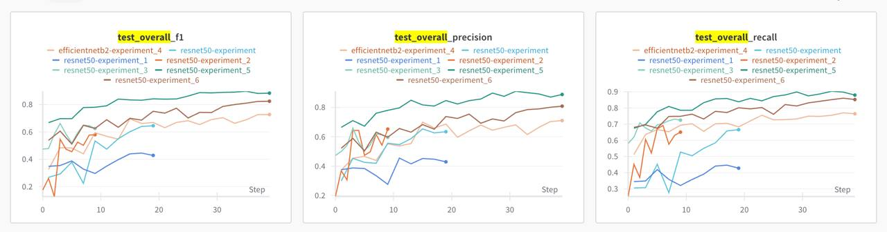

Loss went up, while all other quality metrics decreased. Compared to baseline, solution is still better, however the decrease appeared compared to last test.

**Conclusion:** By penalizing errors in minority classes more heavily, class weights help improve the model's ability to generalize. 
However, there is a risk that the model may focus too much on learning from minority classes at the expense of majority classes. This imbalance can lead to a loss of important information that is necessary for making accurate predictions across all classes. Determining appropriate class weights often requires careful tuning and experimentation. 

7. **Stochastic Gradient Descent (SGD) optimizer**

**Goal:** increase training speed and minimize the loss function effectively

**Idea:** to use stochastic gradient descent (SGD) as optimizer as it is known for its computational and memory efficiency. 

**Results:** 

Let us compare with previous test as so far it showed the best results.

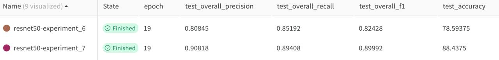

All overall and per class metrics have improved significaintly.

**Conclusion:** The stochastic nature of SGD introduces randomness into the optimization process, which helps the algorithm escape local minima and explore the parameter space more effectively.

8. **Enhanced EfficientNet-B2 model**

**Goal:** try own model architecture by adding best practices to existing pre-trained model. Make a big jump up in quality thanks to research and its application. 

**Idea:** Having conducted research on pre-trained model usage, especially for medical data, I made several significant improvements to the model:

- Increased the number of trainable layers.
- Added a multi-layer classifier with three dense blocks. Each has batch normalization for better training stability, ReLU activation for non-linearity, dropout for regularization.
- Added channel attention to weigh feature channels adaptively.
- Implemented dropout with configurable rate (default 0.4).

Now the model has the following feature flow:

Input image -> EfficientNet features -> Feature maps -> Global Average Pooling -> Flattened features -> Channel Attention -> Attended features -> Classifier -> Output (see visualisation of architecture above)

**Results:** 

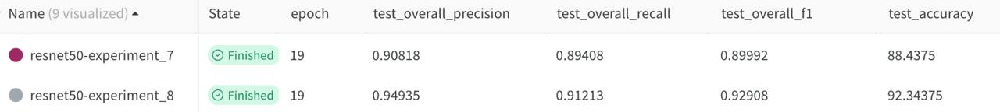

Let us compare with previous test as so far it showed the best results. We can see further improvement in quality. 
It undergirds the importance of mindful usage of pre-trained models.

**Conclusion:**
The more modification based on peculiarities of the data is done, the better result and quality can be achieved. 
For instance, small and poorly varied datasets as the one I used are at a big risk of overfitting and demand attention to robustness and generalization capabilities for smaller classes.

### Appendix. Comparison of experiments: graphs and tables

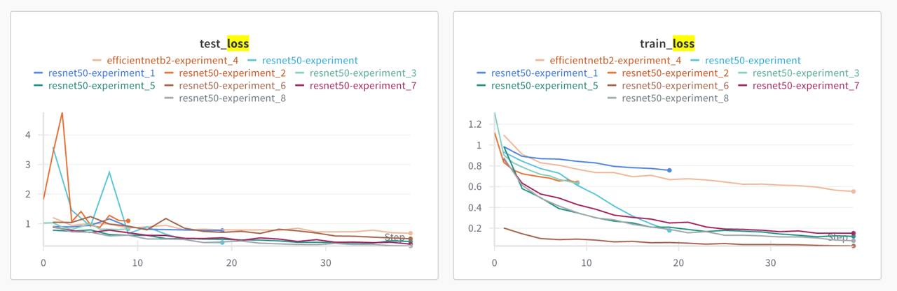

**Overall quality metrics**
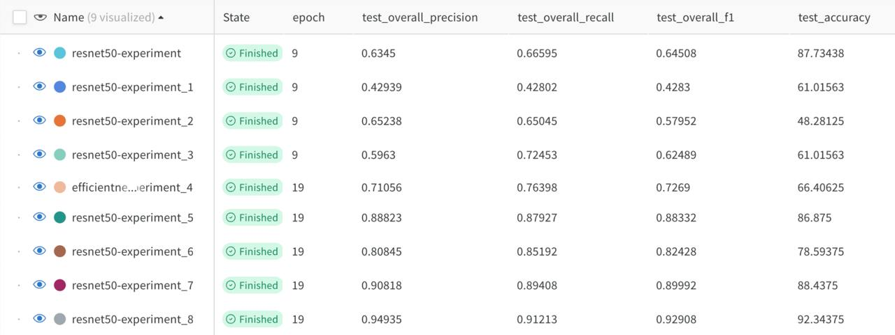

**Precision and Recall by class**

**F1 by class**

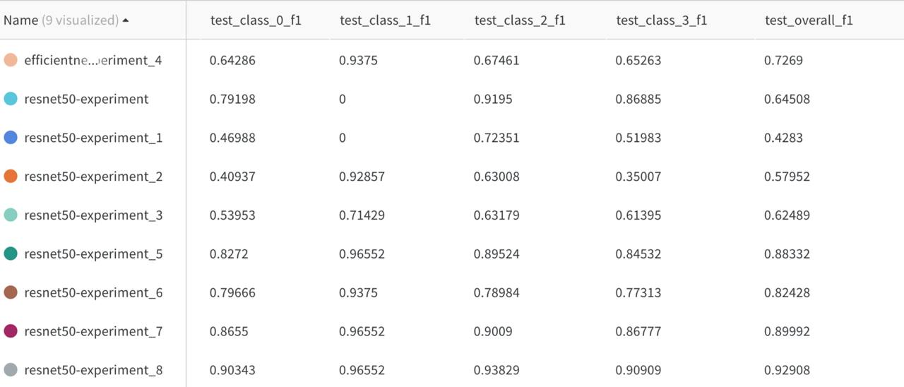

**Loss**

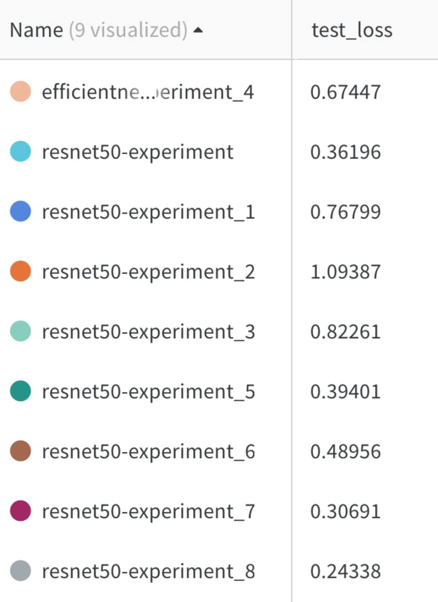

